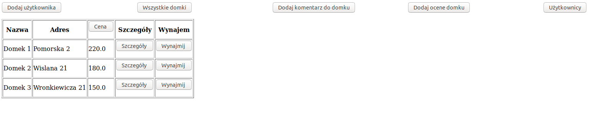
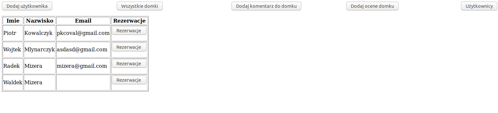

# RENT A HOUSE

PROJEKT STRONY INTERNETOWEJ OBSŁUGUJĄCEJ WYNAJMOWANIE DOMKÓW:

FUNKCJONALNOSCI:

-Klient może wynająć domek po wcześniejszym sprawdzeniu
czy w danym okresie domek nie jest już wynajęty

-Do domków możemy dodawać komentarze i oceny

-Klient może sprawdzić termin, w którym wynajął domek
oraz końcową cenę wynajmu

-Możemy dodawać nowych klientów

-Możemy przeglądać wprowadzone domki ich dane oraz szczegóły takie jak komentarz i ocenę

-Po zarezerwowaniu domku wysyłany jest email do klienta z datą pobytu, cena wynajmu i czy wybrał dodatkowo pościel i recznik

 ## Technologie:
 
 Spring, Hibernate, 
 
 ## Screen:
 

